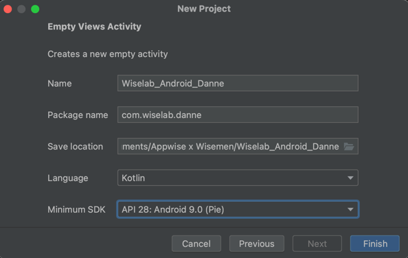

author: Wisemen
summary: Wiselab Android 1
id: index
tags:
categories:
environments:
status: Draft

# Wiselab Android 1

## What you'll learn: overview

Duration: 1:00:00


Hello fellow developer! Welcome to **Wisemen**, we are happy to have you on board! We want to make sure you are
soon up to speed with the core of Android development and our way of working.
Therefore we created this awesome series of **CodeLabs** for you. These are a constant work in progress, so please
let us know if you have any feedback or suggestions!
This is what you will learn in this CodeLab:

### 1. Creating a new project with our Android Core Library

We have our own Android Core Library that we use in all our projects. This library contains a lot of useful classes
and functions that we use in all our projects.

### 2. Folder structure

We have a specific folder structure that we use in all our projects. This is to make sure that we can easily find
all the files we need.

### 3. AGILE

1. Work with **Jira**
2. Using **Bitbucket** for version control
3. Branching strategy
4. **Pull Requests**

### 4. Creating a first screen

* How to use **Figma**
* Write some code!
* Write some more code!
* Create your first **PR** (pull request)

### Let's get started!


## What you need: Prerequisites

Duration: 0:55:00

Before we start, make sure you have everything you need to complete this **WiseLab**. You will need:

### Android Studio

Download the IDE here if you don't have it already!
[Android Studio](https://developer.android.com/studio)

### Figma

Our designers work with **Figma**. You can download it here:

* [Figma](https://www.figma.com/downloads/)

To access the designs you need to log in with your Wisemen account:

* [Figma wireframes](https://www.figma.com/file/hebgv4Qx8VanMAQkO1NFpa/Onboarding-to-do?node-id=407-4095&t=2qdyy89lKwN7dFw3-0)

### BitBucket repository

*ToDo: Add link to BitBucket repository*

### Jira access

*ToDo: Add link to Jira*

## Create the project

Duration: 0:50:00

### 3.1 Create a new project

Open Android Studio and create a new project. You can name it Wiselab_Android_YOURNAME.



### 3.2 Link your project to BitBucket

You can find the link to your repo on your [personal Confluence](https://appwise.atlassian.net/wiki/home) page.


#### Use the terminal or IDE to link your project to BitBucket

We will show you how to work with the ***terminal***. If you prefer to work with the ***IDE***, you can find the
instructions [here](https://www.jetbrains.com/help/idea/set-up-a-git-repository.html#add-remote).

* Open the terminal in Android Studio (bottom left corner)
* add remote origin to project
* ```shell
  git init
  git remote add origin <your repo url>
  ```

From here on you can choose to use the terminal or the IDE to work with Git.

### 3.3 Our Branching strategy

We use the **Gitflow** branching strategy. You can find more information about this
strategy [here](https://www.atlassian.com/git/tutorials/comparing-workflows/gitflow-workflow).

* **master** branch: this branch contains the latest release of the app
* **staging** branch: this branch is used send to the client for testing
* **QA** branch: this branch is used to test the features before they are merged into the develop branch
* **develop** branch: this branch contains the latest development changes
* **feature/...** branches: these branches are used to develop new features for the upcoming release
* **bugfix/...** branches: these branches are used to fix bugs in the app

Make sure you have created all 4 'standard' branches. You can do this by either using the terminal, IDE or a GUI
tool like [SourceTree](https://www.sourcetreeapp.com/) or [Fork](https://git-fork.com/).

Now checkout the **develop** branch and create a new feature branch called **feature/setup-project**.

## Add the Android Core Library

Duration: 0:40:00

Now that you have created your project, it's time to add
our [Android Core Library](https://github.com/appwise-labs/AndroidCore)! This library contains a lot of useful
classes and functions that we use in all our projects. The latest version is also noted in the readme.

### 4.1 Open the **build.gradle** file of your **project**

* Add the following **buildscript** to the top of the file:

```gradle
buildscript {
    ext {
        android_core_version = "1.4.3"
        room_version = '2.5.1'
        nav_version = "2.5.3"
    }
    dependencies {
        classpath 'com.google.gms:google-services:4.3.15'
        classpath 'gradle.plugin.com.onesignal:onesignal-gradle-plugin:0.14.0'
    }
}
```

* Make sure you have the following plugins:

```gradle
plugins {
    id 'com.android.application' version '8.0.0' apply false
    id 'com.android.library' version '8.0.0' apply false
    id 'org.jetbrains.kotlin.android' version '1.8.10' apply false
    id 'androidx.navigation.safeargs.kotlin' version "$nav_version" apply false
}
```

* Under the plugins add the following task:

```gradle
task clean(type: Delete) {
    delete rootProject.buildDir
}
```

### 4.2 Open the **settings.gradle** file of your **project**

* Under the **repositories** tag in the **dependencyResolutionManagement** block, add the following:

```gradle
mavenLocal()
    maven { url 'maven.google.com' }
    maven { url 'https://maven.fabric.io/public' }
    maven { url "https://jitpack.io" }
    maven { url 'https://plugins.gradle.org/m2/'}
```

### 4.3 Open the **build.gradle** file of your **app**

* Add the following **plugins**

```gradle
plugins {
    id 'com.android.application'
    id 'org.jetbrains.kotlin.android'
    id 'kotlin-kapt'
    id 'androidx.navigation.safeargs.kotlin'
}
```

* Under the _kotlinOptions_ in the android block, add the following:

```gradle
buildFeatures {
    dataBinding true
    viewBinding true
}
```

* Add the following **dependencies**

```gradle
// Core
    implementation "com.github.appwise-labs.AndroidCore:core:$android_core_version"
    implementation "com.github.appwise-labs.AndroidCore:room:$android_core_version"
    implementation "com.github.appwise-labs.AndroidCore:networking:$android_core_version"
    
// Room
    kapt "androidx.room:room-compiler:$room_version"
```

Now you can sync your project and you're ready to go! 🚀
If you have any more questions about the Android Core Library, you can find more information on the link above.

Don't forget to push these changes to your **feature/setup-project** branch with a clear commit message.

## Setup Project

