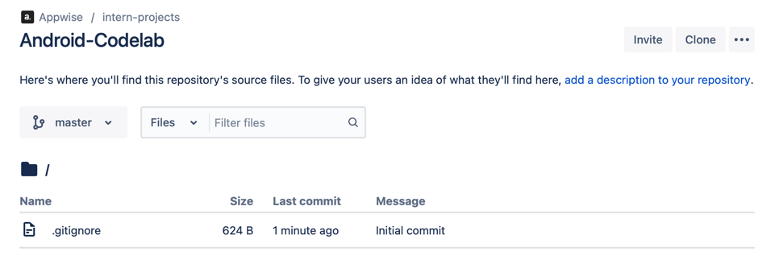
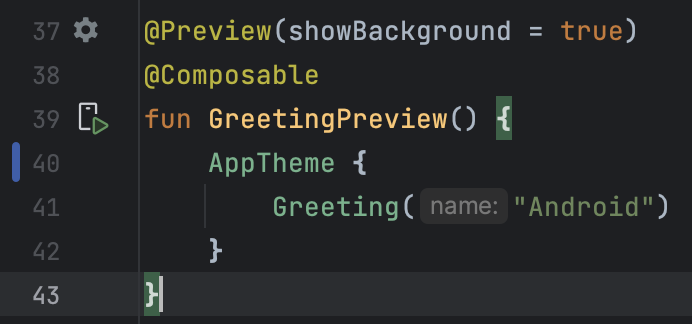
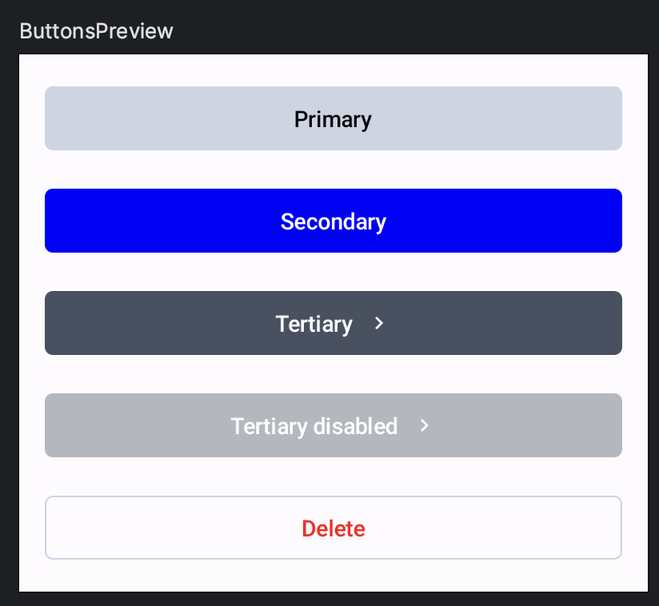

author: Wisemen
summary: Wiselab Android 1
id: index
tags:
categories:
environments:
status: Draft

# Wiselab Android 1

## What you'll learn: overview

Duration: 1:00:00


Hello fellow developer! Welcome to **Wisemen**, we are happy to have you on board! We want to make sure you are
soon up to speed with the core of Android development and our way of working.
Therefore we created this awesome series of **CodeLabs** for you. These are a constant work in progress, so please
let us know if you have any feedback or suggestions!
This is what you will learn in this CodeLab:

### 1. Creating a new project with our Android Core Library

We have our own Android Core Library that we use in all our projects. This library contains a lot of useful classes
and functions that we use in all our projects.

### 2. Folder structure

We have a specific folder structure that we use in all our projects. This is to make sure that we can easily find
all the files we need.

### 3. AGILE

1. Work with **Jira**
2. Using **Bitbucket** for version control
3. Branching strategy
4. **Pull Requests**

### 4. Creating your first app

You will be creating a simple To-Do app. This app will have a few features that are written out in Jira.

We are currently in a transition phase from **XML** to **Jetpack Compose**. Therefore we will be using **Jetpack
Compose** for this app.
Jetpack Compose is a new way of writing UI for Android apps in a more declarative way. You can find more
information about Jetpack Compose [here](https://developer.android.com/jetpack/compose).
Our Legacy projects are still written in XML, but as time comes you'll get to learn that as well! Our new projects
are written in Jetpack Compose, therefore we will be using that for this Wiselab.

### Let's get started!


## What you need: Prerequisites

Duration: 0:55:00

Before we start, make sure you have everything you need to complete this **WiseLab**. You will need:

### Android Studio

Download the IDE here if you don't have it already!
[Android Studio](https://developer.android.com/studio)

### Figma

Our designers work with **Figma**. You can download it here:

* [Figma](https://www.figma.com/downloads/)

To access the designs you need to log in with your Wisemen account:

* [Figma wireframes](https://www.figma.com/file/hebgv4Qx8VanMAQkO1NFpa/Onboarding-to-do?node-id=407-4095&t=2qdyy89lKwN7dFw3-0)

### GitHub Repository

* You can find the link to your repo on your [personal Confluence](https://appwise.atlassian.net/wiki/home) page.

### Jira access

*ToDo: Add link to Jira*

## Create the project

Duration: 0:50:00

### 3.1 Create a new project

Open Android Studio and create a new Compose project. You can name it Wiselab_Android_<<Name>>.


Make sure your package name is: **com.wiselab.wiselab_android_<<name>>**

### 3.2 Link your project to GitHub

You can find the link to your repo on your [personal Confluence](https://appwise.atlassian.net/wiki/home) page.



#### Use the terminal or IDE to link your project to BitBucket

We recommend to use a GIT GUI like [SourceTree](https://www.sourcetreeapp.com/) or [Fork](https://git-fork.com/).
As backup we will show you how to work with the ***terminal***. If you prefer to work with the ***IDE***, you can
find the
instructions [here](https://www.jetbrains.com/help/idea/set-up-a-git-repository.html#add-remote).

* Open the terminal in Android Studio (bottom left corner)
* add remote origin to project
* ```shell
  git init
  git remote add origin <your repo url>
  ```

From here on you can choose to use the terminal or the IDE to work with Git.

### 3.3 Our Branching strategy

We use the **Gitflow** branching strategy. You can find more information about this
strategy [here](https://www.atlassian.com/git/tutorials/comparing-workflows/gitflow-workflow).

* **develop** branch: this branch contains the latest development changes
* **QA** branch: this branch is used to test the features before they are merged into the staging branch
* **staging** branch: this branch is used send to the client for testing
* **master** branch: this branch contains the latest release of the app

* **feature/...** branches: these branches are used to develop new features for the upcoming release and are only
  pushed to develop
* **bugfix/...** branches: these branches are used to fix bugs in the app and are only pushed to develop

Make sure you have created all 4 'standard' branches. You can do this by either using the terminal, IDE or a GUI
tool like [SourceTree](https://www.sourcetreeapp.com/) or [Fork](https://git-fork.com/).

Now checkout the **develop** branch and create a new feature branch called **feature/setup-project**.

## Add the Android Core Library

Duration: 0:40:00

Now that you have created your project, it's time to add
our [Android Core Library](https://github.com/appwise-labs/AndroidCore)! This library contains a lot of useful
classes and functions that we use in all our projects. The latest version is also noted in the readme.

### 4.1 Open the **build.gradle** file of your **project**

* Add the following **plugins** to the top of the file:
* Be sure to check for the latest versions on the links above the plugins!
* This is needed to use the Room dependency for our local database

```gradle.kts
plugins {
    // https://mvnrepository.com/artifact/com.android.application/com.android.application.gradle.plugin?repo=google
    id("com.android.application") version "<<version>>" apply false
    
    // https://plugins.gradle.org/plugin/org.jetbrains.kotlin.android
    id("org.jetbrains.kotlin.android") version "<<version>>" apply false
    
    https://github.com/google/ksp/releases
    id("com.google.devtools.ksp") version "<<version>>" apply false
}
```

### 4.2 Open the **settings.gradle** file of your **project**

* Under the **repositories** tag in the **dependencyResolutionManagement** block, add the following:

```gradle.kts
repositories {
    google()
    mavenCentral()
    
    maven("maven.google.com")
    maven("https://maven.fabric.io/public")
    maven("https://jitpack.io")
    maven("https://plugins.gradle.org/m2/")
}
```

### 4.3 Open the **build.gradle** file of your **app**

* Make sure you have following **plugins**

```gradle.kts
plugins {
    id("com.android.application")
    id("org.jetbrains.kotlin.android")
    id("com.google.devtools.ksp")
}
```

* Add the following **dependencies**. The versions can be found in the url above the dependencies.

```gradle
    //Appwise core dependencies
    //https://jitpack.io/#appwise-labs/AndroidCore
    implementation("com.github.appwise-labs.AndroidCore:core:<<version>>")
    implementation("com.github.appwise-labs.AndroidCore:room:<<version>>")
    implementation("com.github.appwise-labs.AndroidCore:networking:<<version>>")

    //Room
    //https://developer.android.com/jetpack/androidx/releases/room
    implementation("androidx.room:room-runtime:<<version>>")
    ksp("androidx.room:room-compiler:<<version>>")
    
    //Koin for dependency injection
    //https://insert-koin.io/docs/setup/koin/
    implementation("io.insert-koin:koin-core:<<version>>")
    implementation("io.insert-koin:koin-android:<<version>>")
    implementation("io.insert-koin:koin-androidx-compose:<<version>>")
    
    //Compose navigation
    //https://github.com/raamcosta/compose-destinations
    implementation("io.github.raamcosta.compose-destinations:animations-core:<<version>>")
    ksp("io.github.raamcosta.compose-destinations:ksp:<<version>>")
```

Now you can sync your project and you're ready to go! 🚀
If you have any more questions about the Android Core Library, you can find more information on the link above.

Don't forget to push these changes to your **feature/setup-project** branch with a clear commit message.

## Setup Project

It's time to set some last few things before we can start coding!

In case you
forgot: [Figma wireframes](https://www.figma.com/file/hebgv4Qx8VanMAQkO1NFpa/Onboarding-to-do?node-id=407-4095&t=2qdyy89lKwN7dFw3-0)

### 5.1 App class

Let's start by creating the **App** class. This is the first class that is called when the app starts. We will use
this class to set up our dependency injection and navigation in the future.
Create a new class in the main package called **App** and add the following code:

```kotlin

class App : Application() {

    companion object {
        lateinit var instance: App
            private set

        fun isProxymanEnabled() = BuildConfig.DEBUG && BuildConfig.BUILD_TYPE != "release"
    }

    override fun onCreate() {
        super.onCreate()

        instance = this
    }
}
```

Let's explain this bit of code. The **App** class extends the **Application** class. This is the first class that
is called when the app starts. We use the **companion object** to create a singleton of the **App** class. This way
we can access the **App** class from anywhere in the app. We also use this class to check if we are in debug mode
and if we are not in release mode. This is used to enable the Proxyman interceptor for debugging purposes. The
instance of the **App** class is set in the **onCreate** function.

* Create a new private function called initCore to set up the Android Core Library. This function will be called in
  the **onCreate** function.
* Add the following code to the **initCore** function:

```kotlin
CoreApp.init(this)
    .apply {
        if (BuildConfig.DEBUG) {
            initializeErrorActivity(true)
        }
    }
    .initializeLogger(getString(R.string.app_name), BuildConfig.DEBUG)
    .build()
```

This code initializes the Android Core Library. We also initialize the error activity and the logger. The logger is
used to log messages to the console. The error activity is used to show errors in the app. This is only enabled in
debug mode.

* Don't forget to add the **initCore** function to the **onCreate** function.

### 5.1 Theme

* Go to the figma file under the colors tab and place the colors in the **Color.kt** file under the theme package.
* Change the colors of the **LightColorScheme** in the theme.kt file, delete the **DarkColorScheme** because we are
  not going to implement a dark theme.
* Check the [Material3](https://m3.material.io/styles/color/the-color-system/key-colors-tones) guidelines for the
  key colors and Color roles.
* Change the **Theme**-function to the most basic version like this:

 ```kotlin
    @Composable
fun AppTheme(
    content: @Composable () -> Unit
) {
    val colors = LightColorScheme

    MaterialTheme(
        colorScheme = colors,
        content = content
    )
}
```

### 5.2 TextStyles

* Add an **object**-file named **TextStyles** to preset our different text styles. 🔤
* Use the [Material3](https://m3.material.io/styles/typography/applying-type) guidelines for the different text
  styles.
* Create the following styles in this file:
    * HeadlineLarge
    * HeadlineMedium
    * HeadlineSmall
    * Subtitle
    * LabelLarge
    * LabelSmall
    * BodyLarge
    * BodySmall
    * Button

* Let's create the first style together: Look at the figma design for the largest headline: "Mijn to do's". Click
  on it until it is the only component selected. You can see the text style in the right panel. Use these values to
  create the **HeadlineLarge** style:

```kotlin

object TextStyles {

    val headlineLarge = TextStyle(
        fontSize = 34.sp,
        fontWeight = FontWeight.W700,
        lineHeight = 41.sp,
        letterSpacing = 0.37.sp
    )
}
```

* Note that we use the **Sp** unit for the font size, line height and letter spacing. This is because we want to
  use the **Sp** unit for all our text styles. This way the text will scale with the system font size. Don't mind
  the fontFamily, SF Pro Display is the default font on iOS. The color is not needed because we will set the color
  in the theme.

### 5.3 Spacing

* Add an **object**-file named **Spacing** to preset our different spacing values. 📏
* Use the [Material3](https://m3.material.io/layout/spacing) guidelines for the different spacing values.
* Use this as a reference for the different spacing values:

```kotlin
package com.wiselab.onboarding_compose.ui.theme

import androidx.compose.material3.MaterialTheme
import androidx.compose.runtime.Composable
import androidx.compose.runtime.ReadOnlyComposable
import androidx.compose.runtime.compositionLocalOf
import androidx.compose.ui.unit.Dp
import androidx.compose.ui.unit.dp

object Spacing {
    val default: Dp = 0.dp
    val extraSmall: Dp = 4.dp
    val small: Dp = 8.dp
    val medium: Dp = 16.dp
    val large: Dp = 24.dp
    val extraLarge: Dp = 40.dp
    val huge: Dp = 64.dp
}
```

### 5.3 Check your first preview

* Go to the **MainActivity.kt** file and check for errors.
* Change the previous theme name to the new **AppTheme** name and clear the imports

### 5.3.1 Add a virtual or physical device

If you don't have a virtual or physical device, you can create one by following these steps: 📱

**Physical device**

* Go to your phone settings and enable **Developer options**. If you don't know how to do this, you can find more
  information [here](https://developer.android.com/studio/debug/dev-options).
* Connect you phone to your computer with either USB or Wireless debugging. You can find more
  information [here](https://developer.android.com/tools/adb#connect-to-a-device-over-wi-fi).

**Virtual device**

* Go to the **AVD Manager** in Android Studio and create a new virtual device. You can find more
  information [here](https://developer.android.com/studio/run/managing-avds).

### 5.3.2 Run the preview

In the **MainActivity.kt** file, click on the **Preview** button next to the **GreetingPreview** function. This
will open a preview of your app in the IDE. If you have a virtual or physical device connected, you can also run
the app on your device.



Now you can push your changes to your **feature/setup-project** branch with a clear commit message and create a
pull request to merge your branch into the **develop** branch. Don't forget to add your buddy as a reviewer! 🕵️
## Agile
We want to work as efficient as possible. Therefore we use the Agile way of working. We created our custom [Agile Bible](https://theagilebible.com) where we describe how we work the Agile way. Make sure to check it out!

### 6.1 Jira
Open your browser and go to your personal onboarding Jira board. You can find the link on your personal [confluence](https://appwise.atlassian.net/wiki/home) page. If you can't find it, ask your buddy.

## Create your first components and screen

Start creating some UI components and a screen to show them on. Starting with
the [landing screen](https://www.figma.com/file/hebgv4Qx8VanMAQkO1NFpa/Onboarding-to-do?type=design&node-id=455-5009&mode=design&t=a3AEuYp0dvS3MRfT-4)
where we can register or log in. We always name our branches to the Jira ticket. The first ticket we will work on
is **OB-1**. Create a new branch called `feature/ob-1--landing-screen`

* Drag the Jira ticket to the **In Development** column.

### 7.1 Create some buttons

* Open the figma file and check the **components used** page. This is where you can find all
  the [components used](https://www.figma.com/file/hebgv4Qx8VanMAQkO1NFpa/Onboarding-to-do?type=design&node-id=877-1328&mode=dev) in the design.
* Create a new package called **shared**. The full path should be  **com.wiselab.<<name>>.ui.shared**.
* Create a new Kotlin file named **Buttons** in the **Shared** package to create our different buttons
* Create the following buttons:
    * PrimaryButton
    * SecondaryButton
    * TertiaryButton
    * OutlinedButton
* Show a preview of the buttons like this:



Note that you can see the preview when clicking on the  button in the top
right corner of the IDE.

* Here's a bit of code to get you going:

```kotlin
@Preview
@Composable
fun ButtonsPreview() {
    AppTheme {
        Column(
            modifier = Modifier
                .fillMaxWidth()
                .background(MaterialTheme.colorScheme.background)
                .padding(Spacing.medium),
            verticalArrangement = Arrangement.spacedBy(Spacing.medium)
        ) {
            Buttons.Primary(
                text = "Primary",
                Modifier.fillMaxWidth()
            ) {}
        }
    }
}

object Buttons {

    @Composable
    fun Primary(
        text: String,
        modifier: Modifier = Modifier,
        onClick: () -> Unit
    ) {
        Button(
            modifier = modifier,
            shape = RoundedCornerShape(5.dp),
            colors = ButtonDefaults.buttonColors(
                containerColor = Color.PeriWinkel,
                contentColor = Color.Black
            ),
            onClick = onClick
        ) {
            Text(text = text)
        }
    }
}
```

* Let's explain what's going on here:

first off we create the object Buttons. This is a container for all our buttons. We do this so we can easily find
all our buttons in the project.
Then we create a composable function for each button. This way we can easily reuse the buttons in our project.
The Primary Button has 3 parameters:

* text: String
* modifier: Modifier
* onClick: () -> Unit

The text and onClick parameters speak for themselves. The modifier is a bit more complicated. It's a way to
add styling to our button like positioning, padding etc..., but more about this later.

* Next the **preview** is created, we always place these above the object:

Make sure to check the modifiers we use here. The `fillMaxWidth` modifier makes sure the button takes up the full
width of the screen. The `background` modifier makes sure the background color is the same as the background color
of the app. The `padding` modifier makes sure there is some space between the buttons. The `verticalArrangement`
makes sure the buttons are spaced out vertically.

* Now create the other buttons and show them in the preview.
* Commits linked to Jira tickets should always contain the ticket number. In this case **OB-1**. The commit message
  should look something like this: **OB-1: Create button components**.

### 7.2 Create a screen

The task manager is seen as 2 Epics, onboarding and todo's. create a new package **com.wiselab.<<name>>.onboarding**.
In this package create a new package called **landing** for the landing screen. The full path should be **com.wiselab.<<name>>.onboarding.landing**.

* Create a new Kotlin file called **LandingScreen** in the **landing** package.
* We like to split up our screens in minimal 3 parts, we go in more detail about this in a future section. For now
    * **Layout**: this is where we place all the content of the screen
    * **Screen**: this is where we link our data and state to the layout
    * **Preview**: this is where we show the layout in a preview
* This is also the order we create them in. Note that this is not the order in the file. We always place the
  preview above the screen and the screen above the layout.

* This is the preview we are working towards:


#### 7.2.1 Create the Layout

* Create a composable function called **LandingLayout**. This is where we place all the content of the screen.
* Because there are 2 buttons vertically aligned we will be using the **Column** Composable as previously explained.
* The function will look something like this:

```kotlin
@Composable
fun LandingLayout() {
    Scaffold {
        Column(
            modifier = Modifier
                .fillMaxWidth()
                .wrapContentHeight()
                .padding(horizontal = Spacing.medium)
        ) {
            Buttons.Primary(text = "Create an account", Modifier.fillMaxWidth()) {}
            Buttons.Secondary(
                text = "Log in",
                Modifier
                    .fillMaxWidth()
                    .padding(bottom = 58.dp)
            ) {}
        }
    }
}
```

We use the **fillMaxWidth** modifier to make sure the buttons take up the full width of the screen.
We use the **wrapContentHeight** modifier to make sure the column is only as high as it's content.
We use the **padding** modifier to add some space between the buttons and the edge of the screen. and padding under the secondary button.

Some explanation about **Scaffold** : The **Scaffold** is a Composable that implements the basic material design visual layout.
It has a top bar, bottom bar and a floating action button. We will be using this a lot in our projects. It is like a structured container for our
screen.
At This moment the Scaffold is still experimental, that's why we need to add the `@OptIn(ExperimentalMaterial3Api::class)`

#### 7.2.2 Scaffold Padding

* There is still an issue. The Scaffold must always pass a padding value to it's content. This is because the Scaffold
  has a top bar, bottom bar and a floating action button. We need to make sure the content is not hidden behind these.
* We can fix it like this:

```kotlin 
@Composable
fun LandingLayout() {
    Scaffold { contentPadding ->
        Column(
            modifier = Modifier
                .fillMaxWidth()
                .wrapContentHeight()
                .padding(contentPadding)
                .padding(horizontal = Spacing.medium)
        ) {
            Buttons.Primary(text = "Create an account", Modifier.fillMaxWidth()) {}
            Buttons.Secondary(
                text = "Log in",
                Modifier
                    .fillMaxWidth()
                    .padding(bottom = 58.dp)
            ) {}
        }
    }
}
```

Note that the Scaffold padding is always the first padding that is applied. A modifier is always applied from **top to bottom**.

#### 7.2.3 Create the screen

* Now create the **LandingScreen** composable. This is where we place the layout in a screen, this is the parent.
* Here is where we will link our data to our view. We will explain this in a future section.
* For now we will just call our LandingLayout function.
* The function will look something like this:

```kotlin
@OptIn(ExperimentalMaterial3Api::class)
@Composable
fun LandingScreen() {
    LandingLayout()
}

```

#### 7.2.4 Create the preview

* Now create the **LandingScreenPreview** composable. This is where we show the screen in a preview. If you forgot how to create a preview, check
  the **ButtonsPreview**.
* As you will see the buttons are not yet aligned at the bottom. We can fix this by adding a **Spacer** above the buttons like this:

```kotlin
@Composable
fun LandingLayout() {
    Scaffold { contentPadding ->
        Column(
            modifier = Modifier
                .fillMaxWidth()
                .wrapContentHeight()
                .padding(contentPadding)
                .padding(horizontal = Spacing.medium)
        ) {
            Spacer(modifier = Modifier.weight(1f))
            Buttons.Primary(text = "Create an account", Modifier.fillMaxWidth()) {}
            Buttons.Secondary(
                text = "Log in",
                Modifier
                    .fillMaxWidth()
                    .padding(bottom = 58.dp)
            ) {}
        }
    }
}
```

The spacer will take up all the available space and push the buttons to the bottom. The [**
weight** modifier](https://developer.android.com/jetpack/compose/modifiers#weight-in-row-and-column) is used to make sure the spacer takes up all the
available space.

#### 7.2.5 String extraction

* There is still 1 bad practise. Strings should never be hardcoded. We should always use a string resource. We can fix this by adding a string
  resource to the **strings.xml** file.
  The easiest way to do this is to right click on the string and select **Show Context Actions** and then **Extract string resource**. Do this for
  both buttons.
* Use command + click (or windows + click) on the string to navigate to the string resources. Here you can change, add, delete and even translate
  strings.
* Don't forget to commit your changes with a proper commit message!
## Navigation

Let's add navigation to our app. We will use
the [raamcosta compose destinations library](https://github.com/raamcosta/compose-destinations) for this. This
library is a wrapper around the navigation component. It makes it easier to use the navigation component with
compose. It also adds some nice features like **animations** and **deep linking**. We already added the dependency
in the setup of the project.

### 8.1 Setup navigation
* Create a new package called **navigation** in the **onboarding** package like this: **com.wiselab.<<name>>.onboarding.navigation**
* Make a new file called **OnboardingNavGraph** in the **navigation** package.
* Add following code to the file:

```kotlin
import com.ramcosta.composedestinations.annotation.NavGraph
import com.ramcosta.composedestinations.annotation.RootNavGraph

@RootNavGraph(start = true)
@NavGraph
annotation class OnboardingNavGraph(
    val start: Boolean = false
)
```

* This is a **NavGraph**. It's a class that contains all the destinations of a navigation graph. The **@RootNavGraph**
  annotation tells the library that this is the root of the navigation graph. The **@NavGraph** annotation tells the
  library that this is a navigation graph. The **start** parameter tells the library that this is the start of the
  navigation graph. This means that this is the first screen that will be shown when the app starts.
* Open the **LandingScreen** file and add the 2 **annotations** to the **LandingScreen** composable function:
  `@Destination` and `@OnboardingNavGraph(start = true)`
* The **@Destination** annotation tells the library that this is a destination. The **@OnboardingNavGraph(start = true)**
  annotation tells the library that this is the start of the navigation graph. This means that this is the first screen
  that will be shown when the app starts.

### 8.2 Integrate in the MainActivity
* Open the **MainActivity** file and remove the **Greeting** composable function with it's preview.
* Change the class so it looks like this:

```kotlin
class MainActivity : ComponentActivity() {
    @OptIn(ExperimentalMaterial3Api::class)
    override fun onCreate(savedInstanceState: Bundle?) {
        super.onCreate(savedInstanceState)
        setContent {
            AppTheme {
                val navController = rememberNavController()

                Scaffold { paddingValues ->
                    Box(
                        modifier = Modifier
                            .fillMaxSize()
                            .background(MaterialTheme.colorScheme.background)
                            .padding(paddingValues)
                    ) {
                        DestinationsNavHost(
                            navGraph = NavGraphs.onboarding,
                            navController = navController
                        )
                    }
                }
            }
        }
    }
}
```

* We use the **Scaffold** composable to create a basic material design visual layout. We will be using this a lot in our
  projects.
* The Box composable is a container that can contain multiple composable functions. We use it to place the
  **DestinationsNavHost** composable in it.
* The **DestinationsNavHost** composable is a composable function from the destinations library. It's a wrapper around
  the navigation component. It takes a **navGraph** and a **navController** as parameters. The **navGraph** is the
  navigation graph we created in the previous step. The **navController** is a controller that controls the navigation
  between the screens. We will use this later to navigate between screens.

### 8.3 Run your app
In the top right of your IDE you can select the device you want to run your app on. Select a device and run the app
configuration. If you can't find it, try clicking the arrow down to see all configurations like this:


You should see the landing screen now! 🙌🏻
Don't forget to commit an push your changes with a proper commit message including the ticket number!

### 8.4 Time for a PR
* Create a pull request from your feature branch to the develop branch.
* Add your buddy as a reviewer.
* Drag your ticket in Jira from **In Development** to **Pull Request**. 🚀## Working with states

Now that you know how to make your first screen, we can start working with states. To work with states we first need to understand how Composable
functions work.

### 9.1 Composition and recomposition

A basic **Composable function** with no parameters will never change how it is drawn. This implies that the view is never redrawn, unless the parent
Composable function is redrawn.
When a Composable function is redrawn, it is called **recomposition**. One way to trigger recomposition is triggered is when a Composable function is
called with different parameters.
For instance if we have a Composable function that takes a String as a parameter, and we call it with the String "Hello World", and then we call it
again with the String "Hello Wisemen", the Composable function will be recomposed.
If we want to trigger recomposition without changing the parameters, to add increased functionality, we need to use **state**.

### 9.2 State

A State is a way to **store data** in a Composable function. When the state changes, the Composable function is recomposed. A basic way to create a
state is:

```kotlin
var state by remember { mutableStateOf("Hello World") }
```

Here we created a state that holds a String. The state is initialized with the value "Hello World". The state is **mutable**, which triggers
recomposition of the views using this value as parameter.
The **remember** function is used to make sure the state is not recreated every time the Composable function is recomposed. This is important because
if the state is recreated, the value is reset to the initial value.

### 9.3 TextField

The best way to learn how to work with states is to work with a ``TextField``. Like we did for the buttons, we will create a new file called **
EditText.kt**. Here you can create your basic edit texts that can be reused in the future.
Create a basic EditText like this:

```kotlin
@Composable
fun EditText(
    modifier: Modifier = Modifier
) {
    var input = ""

    TextField(
        value = input,
        onValueChange = { input = it },
        modifier = modifier
    )
}
```

When you run this preview and try to type in this textField, you see that nothing happens. This is because the parameters of the EditText are never
changed and the composable function is not smart enough to know that the input variable is changed.
To fix this we need to use state. Change the EditText to this:

```kotlin
@Composable
fun EditText(
    modifier: Modifier = Modifier
) {
    var input by remember { mutableStateOf("") }

    TextField(
        value = input,
        onValueChange = { input = it },
        modifier = modifier
    )
}
```

Now when you run the preview and type in the TextField, you see that the text is updated. This is because the state is changed and the Composable
function is recomposed. **IT LIVES** 🎉

### 9.4 Stateless first and state hoisting

When working with states, it is important to keep your Composable functions stateless as much as possible. As mentioned earlier, a Composable function
is recomposed when the state changes.
If your UI gets more complex, and you use more function hierarchies with all their different states, it can become hard to keep track of all the
states. And also it can lead to **unwanted recompositions** an because of that a **bad performance**.
This also breaks the "single source of responsibility" principle which can lead to bug-prone code.
To prevent this, we can use state hoisting. State hoisting is a way to move the state to the parent Composable function.

Let's improve our EditText with state hoisting so it follows this principle.

```kotlin
@Composable
fun EditText(
    modifier: Modifier = Modifier,
    input: String,
    onInputChanged: (String) -> Unit
) {
    TextField(
        value = input,
        onValueChange = onInputChanged,
        modifier = modifier
    )
}


@Composable
fun ComposableUsingEditText() {
    var input by remember { mutableStateOf("") }

    EditText(
        input = input,
        onInputChanged = { input = it }
    )
}
```

Now the EditText is stateless and the state is hoisted to the parent Composable function.
If you do this for all your Composable functions, you will have a better performance and bugs will be easier to find.

### 9.5. Exercise: Finishing the component library

Now that you know how to style your Composables and how to work with states, you can finish the component library.

Keep these principles in mind:

- Make sure to create a new file for every type of component you create. This way you can reuse them in the future and you don't have to restyle them
  every time.
- Remember to add the modifier parameter to your custom views so they are easier to lay out in the future.
- Make sure to use state hoisting when working with states.
- Use previews to test your components handling of different states.

After you are finished, make a new PR and ask your buddy to review it. 🚀

## MVVM and screen structure

Before we start building our screens, we need to understand how we structure our screens and how we use MVVM.
More complex screens that need to fetch data from the backend or database and manipulate it, need to be structured in a way that is easy to understand
and maintain.

### 10.1 MVVM

MVVM stands for Model-View-ViewModel. It consists of three parts:

- **Model**: The data model that is used in the screen. For this we use repositories as a data source. More on this later when we start with
  networking.
- **View**: The UI of the screen. This is the Composable function that is used to draw the screen. This you know already.
- **ViewModel**: The logic of the screen. This is the class that holds the logic of the screen. It can be used to fetch data from the backend or
  database, manipulate the data and pass it to the view.

### 10.2 ViewModel

As mentioned above, this is the class that holds the logic of the screen.
Since we want to keep the data manipulation and the UI separate, we have some rules for the communication between the ViewModel and the View.

- The ViewModel should never know about the View. This means that the ViewModel should not have any references to the View.
- Any data that needs to be manipulated should be managed here, not in the View.
- The data that is passed to the View should be immutable. This means that the View should not be able to change the data.
- If the data needs to be changed, it should be done in the ViewModel.

### 10.3 Screen structure

Lets look at the image below to see the whole picture of the communication between the View and the ViewModel.


We know, the whole picture is a little overwhelming. But don't worry, we will go through it step by step.

For naming, keep in mind, all these classes work in tandem to create a screen. So we will name them after the screen they are used in.
For instance if we create a login screen, we will have a LoginScreen, LoginViewModel, LoginUiState, LoginActions and so on.

#### 10.3.1 Screen.kt (View)

Here we have the View layer of our screen. This consist of at least 3 composable functions with their own responsibilities: Screen, Layout and Preview

```kotlin
@Composable
fun Screen(
    navController: NavController,
    viewModel: ViewModel = koinViewModel()
) {
    // Collect data from the ViewModel to populate the layout
    val uiState by viewModel.uiState.collectAsState()

    // Establish links between UI events and the navController
    LaunchedEffect(viewModel) {
        viewModel.eventFlow.collect { event: UiEvent ->
            when (event) {
                is UiEvent.NavigateToNext -> navController.navigate(NextDestination)
                is UiEvent.ShowDialog -> // show dialog
            }
        }
    }

    // Link the uiState and action handler to the layout
    Layout(
        state = uiState,
        onAction = viewModel::onAction,
    )
}
```

The `Screen` function is a crucial part of your UI layer (View) in Jetpack Compose.
It serves as the entry point for rendering your screen's content. Here are the key aspects of this function:

- Parameters
    - `NavController`: The navigation controller used for navigating between screens.
    - `ViewModel`: An instance of the ViewModel associated with this screen. We use the dependency injection library Koin to inject the ViewModel.
- Function
    - Collects data from the ViewModel to populate the layout.
    - Establishes links between UI events and the `navController`.
    - Links actions of the ViewModel to the layout components.

```kotlin
@Composable
fun Layout(
    state: UiState,
    onAction: (Action) -> Unit
) {
    // Layout components
}
```

The `Layout` function is responsible for defining the structure of your screen's layout. It plays a central role in rendering the UI. Here's what you
need to know about it:

- Parameters
    - `state: UiState`: Represents the current state of the screen's UI.
    - `onAction: (Action) -> Unit`: A function used to handle UI actions.
- Function
    - Displays the UI components based on the provided `state`.
    - Triggers actions based on user interactions.
    - Also used for preview and testing purposes.

```kotlin
@Preview
@Composable
fun Preview() {
    AppTheme {
        Layout(
            state = UiState(),
            onAction = {}
        )
    }
}
```

The `Preview` function provides a simple, placeholder implementation of the `Layout` with a default state. It's useful for previewing your layout
during development.

#### 10.3.2 ViewModel.kt (ViewModel)

The `ViewModel` class is a critical component in managing the state and behavior of your UI.

```kotlin
class ViewModel(
    private val repository: Repository,
    saveStateHandle: SavedStateHandle
) : ViewModel() {

    // Extracts navigation arguments from the SavedStateHandle to receive data from the previous screen
    private val args = savedStateHandle.navArgs<NavArgs>()

    // The single source of the truth for the UI state
    var state by mutableStateOf(UiState())
        // The setter is private to prevent external modification
        private set

    // A channel for sending events to the UI
    private val eventChannel = Channel<UiEvent>()

    // The channel is exposed as a flow to expose a read-only interface
    val eventFlow = eventChannel.receiveAsFlow()

    // The entry point for UI actions to be handled by the ViewModel
    fun onAction(action: Action) {
        when (action) {
            is Action.OnNextClicked -> eventChannel.trySend(UiEvent.NavigateToNext)
            is Action.OnTextChanged -> state = state.copy(text = action.text)
            is Action.Save -> repository.save(state.text)
        }
    }
}
```

##### Constructor

- Repositories are injected into the `ViewModel` via Koin.
- `savedStateHandle`: An instance of `SavedStateHandle` is injected via Koin, allowing for the preservation of UI state during configuration changes.

##### private val args = savedStateHandle.navArgs<NavArgs>()

- This code snippet extracts navigation arguments from the `SavedStateHandle` to facilitate data exchange between screens during navigation.

##### var state by mutableStateOf(UiState())

- This variable is the single source of truth for the current UI state.
- It is read-only for external sources, ensuring data consistency and reducing bugs.

##### private val eventChannel = Channel<UiEvent>()

- An event channel for sending UI events.
- Exposes `eventFlow` to collect navigation events triggered by the ViewModel.

##### fun onAction(action: Action)

- Handles UI actions triggered by user interactions.
- Updates the UI state as necessary.
- Communicates changes to the Data layer when needed.
- Sends UI events through the event channel.

#### 10.3.3 UiState.kt

```kotlin
data class UiState(
    val text: String = "",
    val isLoading: Boolean = false,
    val error: String = "",
)
```

- `UiState` represents the current and immutable state of the screen.
- Immutability is crucial for ensuring the reliability and predictability of the Compose composition process.
- When you need to update the state, create a new state instance based on the current one rather than modifying the fields directly.

#### 10.3.4 UiEvent.kt

```kotlin
sealed class UiEvent {
    object NavigateToNext : UiEvent()
    data class ShowDialog(val message: String) : UiEvent()
}
```

- `UiEvent` represents various types of events that need to be handled at the View layer.
- These events are often used to trigger navigations, animations, or display dialogs.
- Fired by the ViewModel and handled by the UI.

#### 10.3.5 Action.kt

```kotlin
sealed class Action {
    object OnNextClicked : Action()
    data class OnTextChanged(val text: String) : Action()
    object Save : Action()
}
```

- `Action` represents user-initiated actions from the UI layer.
- These actions are fired by the UI and handled by the ViewModel.

#### 10.3.6 NavArgs.kt

```kotlin
data class NavArgs(
    val id: String = "-1"
)
```

- `NavArgs` is a typed class that holds data passed between screens during navigation.
- This data can be extracted from the `SavedStateHandle` within the ViewModel.
## Start Networking
## Recap